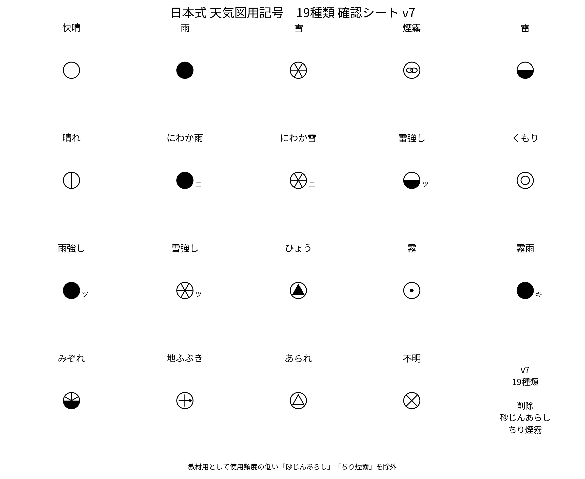

# jpweatherplot

日本式の天気図記号を描画するためのPythonライブラリ


`jpweatherplot` は、中学校理科や気象通報教材で使用される**日本式の天気図記号**を描画するためのPythonライブラリです。

Matplotlib・MetPy・Cartopyと組み合わせて使用することを想定しています。

---

## 主な機能

- 日本式天気図記号（19種類）の描画
- 日本式風向・風力記号の描画
- 観測点モデル（天気・風向・風力・気温・気圧）の描画
- MetPyのQuantityに対応
- Cartopyの地図上への配置に対応

---

## インストール

```bash
pip install -e .
```

MetPy・Cartopyも利用する場合

```bash
pip install -e ".[all]"
```

---

## 使用例

```python
from jpweatherplot import add_station_model

add_station_model(
    ax,
    x=0,
    y=0,
    weather="晴れ",
    wind_direction="北北東",
    wind_force=3,
    temperature=28,
    pressure=1011,
)
```

---

## 天気図記号



---

## 今後の予定

- 気象通報データの読み込み
- 観測地点データベース
- 生徒用天気図シートの自動生成
- MetPyによる参考等圧線の描画
- PDF教材の出力

---

## ライセンス

MIT License
