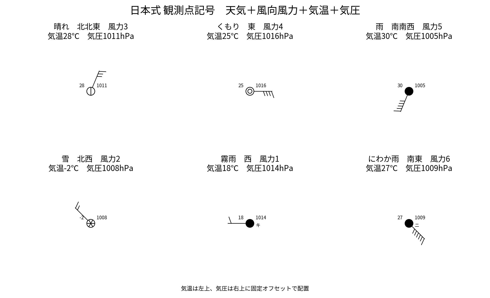

# jpweatherplot

A Python library for drawing Japanese weather chart symbols used in science education.



`jpweatherplot` is a Python library for drawing Japanese weather chart symbols, wind-force symbols, and station models used in Japanese science education.

It is designed to work seamlessly with **Matplotlib**, **MetPy**, and **Cartopy**.


気象通報教材で使うための、**日本式の天気図記号・風向風力記号・観測点モデル**を Matplotlib 上に描く個人用ライブラリです。

> 気象庁公式ライブラリではありません。中学校理科教材向けに、教育出版の天気図記号を参考に調整した描画部品です。

## 現在できること

- 19種類の天気記号
- 風力0〜12の日本式風向・風力記号
- 天気＋風向＋風力の合成
- 気温（左上）・気圧（右上）の表示
- MetPy/Pint Quantity の気温・気圧・角度を受け取り可能
- Cartopy GeoAxes へ緯度経度で配置可能

## インストール

このフォルダで:

```bash
pip install -e .
```

MetPy / Cartopy もまとめて使う場合:

```bash
pip install -e ".[all]"
```

conda 環境で MetPy / Cartopy をすでに入れているなら、通常は `pip install -e .` だけでOKです。

## 基本例

```python
import matplotlib.pyplot as plt
from jpweatherplot import add_station_model

fig, ax = plt.subplots()

add_station_model(
    ax, 0, 0,
    weather="晴れ",
    wind_direction="北北東",
    wind_force=3,
    temperature=28,
    pressure=1011,
)

ax.set_xlim(-1, 1)
ax.set_ylim(-1, 1)
ax.set_aspect("equal")
plt.show()
```

## MetPy Quantity を使う

```python
import matplotlib.pyplot as plt
from metpy.units import units
from jpweatherplot import add_station_model

fig, ax = plt.subplots()

add_station_model(
    ax, 0, 0,
    weather="晴れ",
    wind_direction=22.5 * units.degree,
    wind_force=3,
    temperature=28 * units.degC,
    pressure=1011 * units.hPa,
)

ax.set_xlim(-1, 1)
ax.set_ylim(-1, 1)
ax.set_aspect("equal")
plt.show()
```

## Cartopy 地図上へ配置

```python
import matplotlib.pyplot as plt
import cartopy.crs as ccrs
from metpy.units import units
from jpweatherplot import add_station_model_geo

fig = plt.figure()
ax = fig.add_subplot(1, 1, 1, projection=ccrs.PlateCarree())
ax.coastlines()
ax.set_extent([130, 145, 30, 45])

add_station_model_geo(
    ax,
    136.90, 37.39,  # 輪島
    weather="晴れ",
    wind_direction="北東",
    wind_force=3,
    temperature=28 * units.degC,
    pressure=1011 * units.hPa,
)

plt.show()
```

## API

```python
from jpweatherplot import (
    add_weather_symbol,
    add_wind_force_symbol,
    add_station_model,
    add_station_model_geo,
)
```

### `add_station_model(...)`

主に使う関数です。

- `weather`: `"晴れ"`, `"雨"`, `"雪"` など
- `wind_direction`: `"北北東"` などの16方位、角度の数値、または `units.degree`
- `wind_force`: 0〜12
- `temperature`: 数値または MetPy/Pint Quantity
- `pressure`: 数値または MetPy/Pint Quantity

## 方針

MetPy は **解析・計算**、Cartopy は **地図**、`jpweatherplot` は **日本式の教材用観測記号**を担当する想定です。

将来はこのライブラリを使って、

1. 気象通報データを読み込む
2. 選択地点だけ生徒記入用に空欄化
3. その他の地点は `add_station_model_geo()` で自動描画
4. 必要なら MetPy で参考等圧線を追加
5. A4 PDF を出力

という流れにつなげられます。
